 

## Coder  |  Developer  |  Designer  |  Writer

<table>
  <tr>
    <td>
      
    </td>
    <td>
      
    </td>
  </tr>
</table>

 

----------

<h2 align="center">Tech & Design Stack</h2>

Languages

  

Frameworks & Runtime

  

Design & Creative

  
   
  
  

Tools & Environment

  

 

<h2 align="center">🌐 Connect With Me</h2>

  
  
  
  
  

  

 

  

